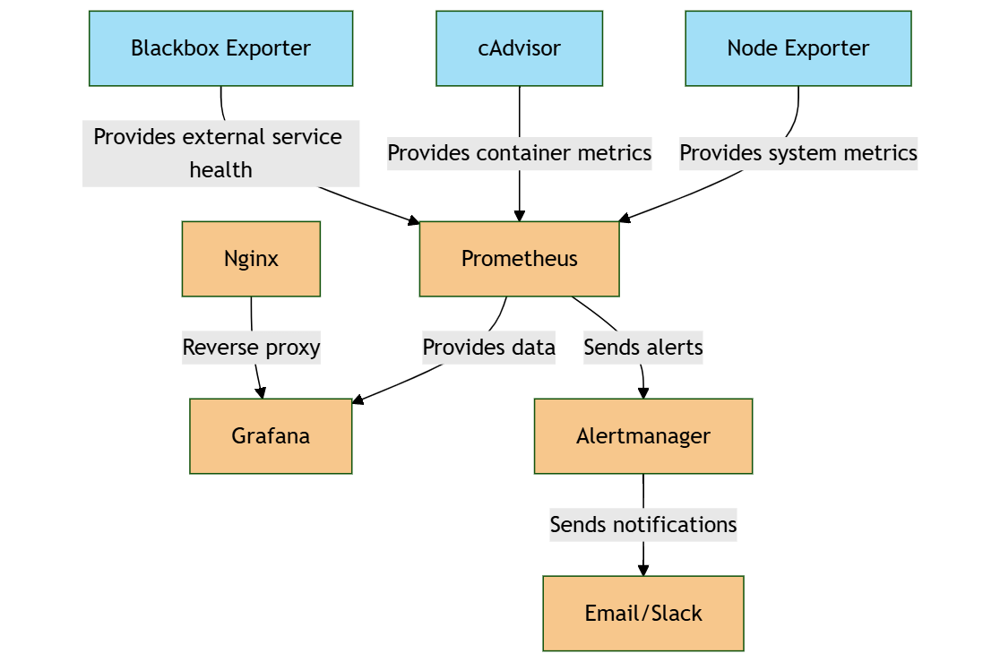

在您提供的專案設定中，這是一個完整的監控系統，整合了 Prometheus、Grafana、Alertmanager、Blackbox、Nginx、Node Exporter、cAdvisor 以及自定義警報和資料收集。以下是專案的 `README.md` 更新，並包含了資料流和架構圖的概述：

---

# 觀察性堆疊專案

此專案設定了一個高效能的監控系統，主要由以下組件組成：
- **Prometheus**: 收集並存儲來自各種來源的指標數據。
- **Grafana**: 用於可視化 Prometheus 收集的數據，並提供儀表板。
- **Alertmanager**: 負責處理來自 Prometheus 的警報，並將其發送到適當的接收者（如電子郵件）。
- **Blackbox Exporter**: 用於監控外部服務的可用性，如 HTTP、ICMP。
- **Nginx**: 反向代理服務器，將不同服務的請求轉發到相應的後端（如 Prometheus、Grafana 等）。
- **Node Exporter**: 收集有關系統的基本指標，如 CPU、內存、磁碟等。
- **cAdvisor**: 用於監控容器的指標。
  
## 目標
1. **監控**：包括系統健康指標、網絡狀態、磁碟空間和內存使用等。
2. **警報**：當發現異常情況（例如系統崩潰、內存或 CPU 過度使用）時，觸發警報並發送通知。
3. **可視化**：將收集的數據以直觀的方式呈現，通過 Grafana 提供的儀表板進行可視化。

## 服務組件

- **Nginx**: 提供反向代理，將流量分發至 Prometheus、Grafana、Alertmanager、Node Exporter、cAdvisor 和 Blackbox 等服務。
- **Prometheus**: 負責抓取來自各個服務（如 Node Exporter、cAdvisor、Blackbox 等）的指標數據。
- **Alertmanager**: 管理 Prometheus 發送的警報，並將警報通知發送到電子郵件等接收端。
- **Grafana**: 顯示 Prometheus 中儲存的指標數據，提供實時的監控儀表板。
- **Node Exporter** 和 **cAdvisor**: 監控系統層面的指標和 Docker 容器的指標。
- **Blackbox**: 監控外部服務的健康狀態（如網站可用性）。

## 資料流和架構

以下是資料流和架構圖的概述：

1. **資料收集**：
   - **Prometheus** 定期抓取 Node Exporter、cAdvisor 和 Blackbox 等服務的指標數據。
   - 收集的數據包括系統性能指標（如 CPU 使用率、內存使用、磁碟空間）和外部服務健康狀態。
   
2. **數據存儲**：
   - Prometheus 儲存所有收集的指標數據，並為 Grafana 提供數據源。
   
3. **可視化與監控**：
   - **Grafana** 使用 Prometheus 作為數據源，提供即時的儀表板來顯示各種監控指標。
   
4. **警報管理**：
   - **Alertmanager** 監控 Prometheus 發送的警報，當警報條件達成時，Alertmanager 會通知相應的收件人。
   
## 架構圖

## 配置

1. **Prometheus 配置**：配置了抓取間隔和警報規則，並將收集到的數據儲存於指定路徑。
2. **Alertmanager 配置**：設置了警報接收者（如電子郵件），並指定了告警的發送間隔和重複發送的時間。
3. **Nginx 配置**：設置反向代理，將請求分發給 Grafana、Prometheus、Alertmanager 和 Blackbox 等服務。

---

這樣的設定確保了您的系統能夠高效地進行監控、警報和資料可視化，同時也有助於及時發現並處理系統中出現的異常情況。