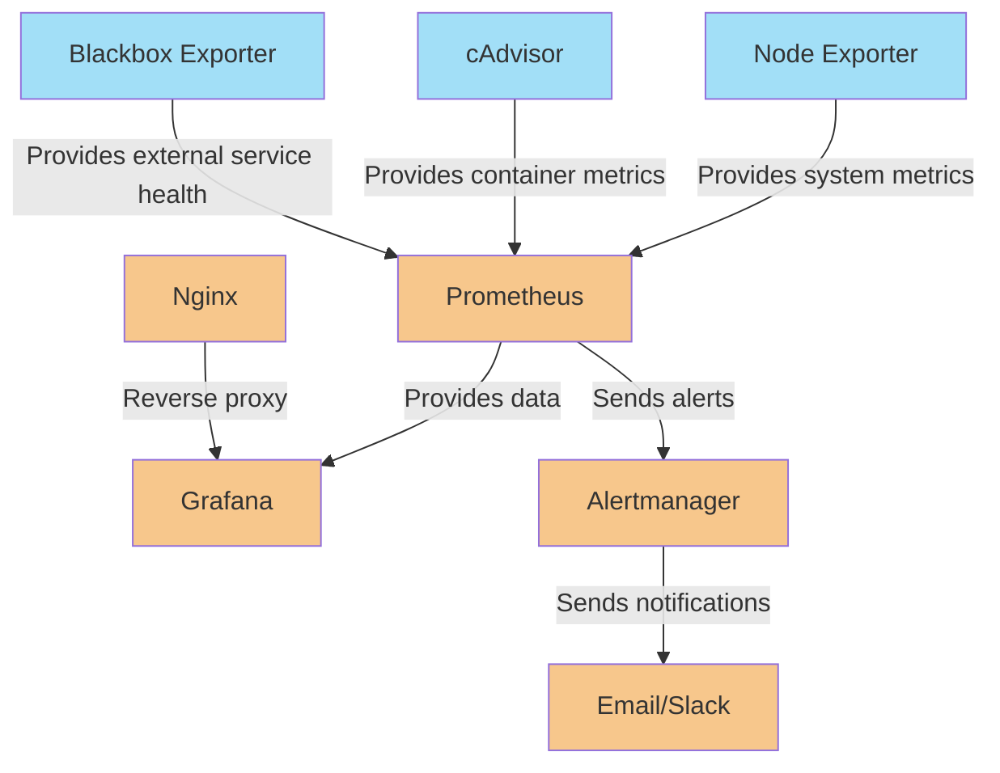

# 專案概述

此專案設定了一個高效能的監控系統，專案的主要組件包括：
- **Prometheus**: 負責收集並存儲來自不同來源的指標數據，並提供查詢接口。
- **Grafana**: 用於可視化 Prometheus 收集的數據，並透過儀表板展示關鍵指標。
- **Alertmanager**:  處理來自 Prometheus 的警報，並將警報發送至相應的接收者（如電子郵件、Slack等）。
- **Blackbox Exporter**: 用於監控外部服務的可用性，如 HTTP、ICMP，提供健康狀態檢查。
- **Nginx**: 作為反向代理，將外部請求轉發至 Prometheus、Grafana、Alertmanager、Node Exporter、cAdvisor 和 Blackbox 等服務。
- **Node Exporter**: 收集有關系統的基本指標，如 CPU、記憶體、磁碟等。
- **cAdvisor**: 監控容器的性能指標，特別是 Docker 容器的資源使用情況。
  
## 目標
1. **監控**
    - 實時監控系統的健康狀態，包括 CPU 使用率、記憶體消耗、磁碟空間、網絡連接等指標。
    - 監控容器（如 Docker）內部的指標，包括資源使用、容器狀態等。
    - 外部服務的可用性監控，如網站的存活檢查。包括系統健康指標、網絡狀態、磁碟空間和記憶體使用等。
2. **警報**
    - 當監控到異常情況（例如系統崩潰、過度使用記憶體或 CPU）時，系統將自動觸發警報並發送通知。
    - 警報通知會根據設定發送到指定的接收端（如電子郵件等）。

3. **可視化**
    - 利用 Grafana 儀表板直觀呈現 Prometheus 收集的數據，並提供即時的監控視圖。
    - 儀表板可自定義，以便運維人員可以根據需要快速查看多個監控指標，進而迅速發現問題並解決。

## 服務組件

- **Nginx**: 提供反向代理，將流量分發至 Prometheus、Grafana、Alertmanager、Node Exporter、cAdvisor 和 Blackbox 等服務。
- **Prometheus**: 負責抓取來自各個服務（如 Node Exporter、cAdvisor、Blackbox 等）的指標數據。
- **Alertmanager**: 管理 Prometheus 發送的警報，並將警報通知發送到電子郵件等接收端。
- **Grafana**: 顯示 Prometheus 中儲存的指標數據，提供實時的監控儀表板。
- **Node Exporter** 和 **cAdvisor**: 監控系統層面的指標和 Docker 容器的指標。
- **Blackbox**: 監控外部服務的健康狀態，例如檢查網站的可用性。

## 資料流和架構

以下是資料流和架構圖的概述：

1. **資料收集**：
   - **Prometheus** 定期抓取 Node Exporter、cAdvisor 和 Blackbox 等服務的指標數據。
   - 收集的數據包括系統性能指標（如 CPU 使用率、記憶體使用、磁碟空間）和外部服務健康狀態。
   
2. **數據存儲和查詢**：
   - Prometheus 儲存所有收集的指標數據，並為 Grafana 提供數據源。
   
3. **可視化與監控**：
   - **Grafana** 從 Prometheus 獲取數據，並在其儀表板上以圖形化的方式展示，讓用戶能夠直觀地監控系統健康狀況。
   
4. **警報管理**：
    - 當 Prometheus 發現異常（如 CPU 或記憶體過度使用），會觸發警報，並由 **Alertmanager**  管理這些警報。
    - 此外，**Blackbox Exporter** 也可能會觸發警報，特別是在監控外部服務的可用性時。當 **Blackbox Exporter** 發現目標服務（如網站）無法訪問或返回錯誤狀態碼（如 5xx 錯誤）時，也會觸發警報。
    - **Alertmanager**  會根據配置將警報通知發送到設置的接收端，如電子郵件或 Slack。

   
## 架構圖

## 配置

1. **Prometheus 配置**：設置抓取間隔和警報規則，將收集到的數據儲存至指定路徑，並設置警報條件。
2. **Alertmanager 配置**：設置了警報接收者（如電子郵件），並指定了告警的發送間隔和重複發送的時間。
3. **Nginx 配置**：設置反向代理，將請求分發給 Grafana、Prometheus、Alertmanager 和 Blackbox 等服務。

